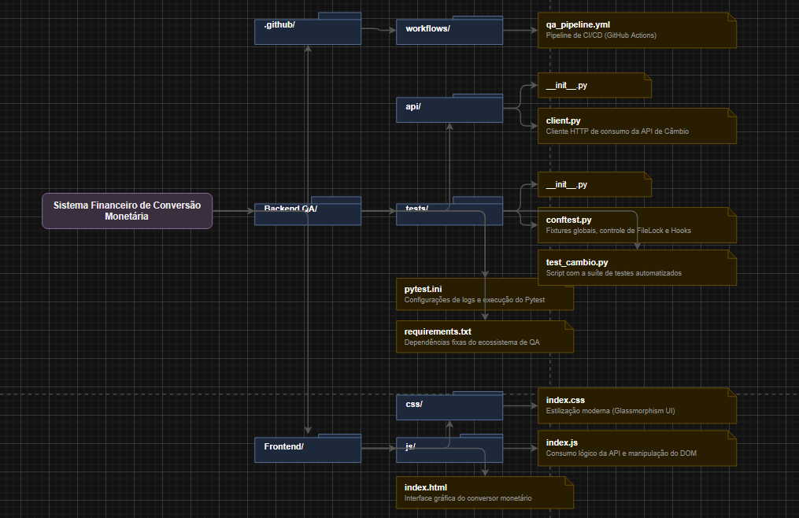
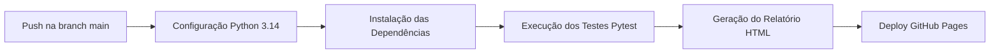
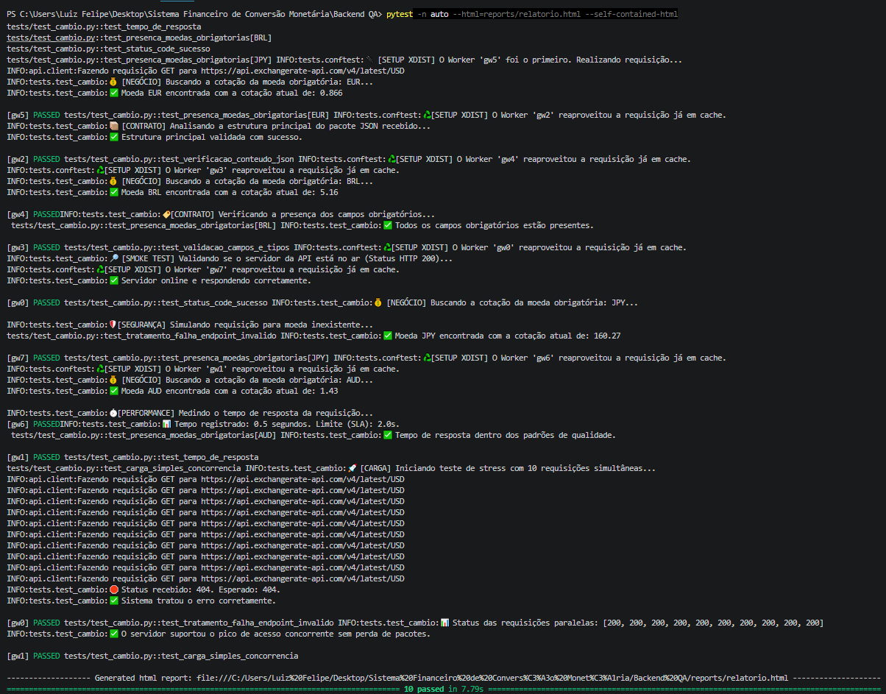
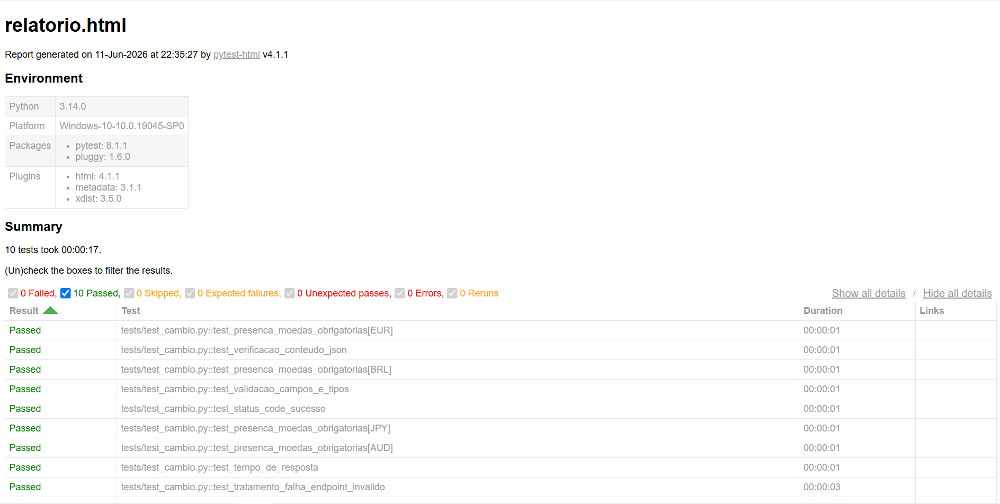
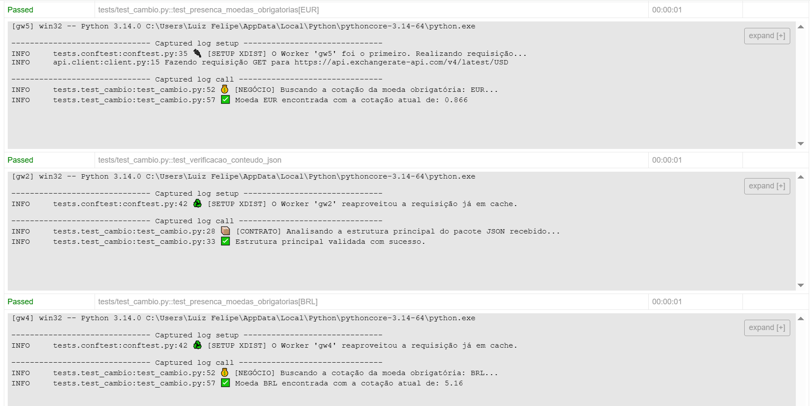

<div align="center">
  <h1>💰 Sistema Financeiro de Conversão Monetária</h1>
  <p><strong>Automação de Testes de Integração (QA) & Interface de Câmbio em Tempo Real</strong></p>
</div>

---

# 🎓 Identificação do Autor e Contexto Acadêmico
* **Universidade Evangpelica de Goiás**
* **Disciplina:** Testes de Software
* **Professor:** Éder José Almeida da Silva
* **Autor:** Luiz Felipe Freitas
* **Registro Acadêmico (RA):** 2312399
* **Contexto:** Trabalho Acadêmico voltado ao curso de Engenharia de Software para a conclusão da disciplina de Teste de Software (QA).

---

# 📝 Descrição do Cenário e Objetivo Acadêmico
Este projeto simula um cenário real do mercado financeiro de *Fintechs*, focado no núcleo de operações internacionais onde a consistência matemática e a velocidade de resposta cambial são críticas. O objetivo acadêmico deste trabalho consiste em aplicar conceitos avançados de **Garantia de Qualidade de Software (QA)** por meio da construção de uma suíte de testes automatizados e integrados robusta, mitigando riscos de quebra de contrato de dados, indisponibilidade de serviços terceiros e violação de Acordos de Nível de Serviço (SLA).

O sistema divide-se em duas frentes integradas:
1. **Frontend:** Uma interface web simples mais moderna para testar na prática a Conversão Monetária.
2. **Backend/QA Automático:** Uma arquitetura de testes de integração escalável, capaz de avaliar endpoints em paralelo sob condições normais e sob estresse concorrente, validando as respostas fornecidas pela API externa `ExchangeRate-API`.

---

# 📐 Arquitetura da Solução de Testes
A arquitetura do motor de testes foi projetada sob o princípio de **Isolamento de Estado com Paralelismo Seguro**.


Para acelerar a esteira de CI/CD, os testes utilizam paralelismo multiprocesso por meio do framework `pytest-xdist`. Para evitar o esgotamento da franquia de requisições da API e mitigar o risco de falso-positivo por *rate limiting*, implementou-se uma **Fixture Avançada com File Lock** em nível de Sistema Operacional (`filelock`).
* O primeiro processo (*worker*) a acordar adquire a trava de exclusão mútua, realiza a chamada HTTP real para a API externa e persiste o payload JSON em uma região temporária em disco.
* Os demais sub-processos concorrentes detectam a existência do cache seguro e reconstróem o objeto de resposta em memória instantaneamente. Isso permite o teste de propriedades matemáticas de tempo (`timedelta`) de forma isolada, limpa e extremamente rápida.

### Diagrama de Arquitetura:



### Mapeamento do Diretório do Projeto:

```text
Sistema Financeiro de Conversão Monetária/
├── .github/
│   └── workflows/
│       └── qa_pipeline.yml         # Pipeline de CI/CD (GitHub Actions)
├── Backend QA/
│   ├── api/
│   │   ├── __init__.py
│   │   └── client.py               # Cliente HTTP de consumo da API de Câmbio
│   ├── tests/
│   │   ├── __init__.py
│   │   ├── conftest.py             # Fixtures globais, controle de FileLock e Hooks do HTML
│   │   └── test_cambio.py          # Script com a suíte de testes automatizados
│   ├── pytest.ini                  # Configurações de logs e execução do Pytest
│   └── requirements.txt            # Dependências fixas do ecossistema de QA
└── Frontend/
    ├── css/
    │   └── index.css               # Estilização moderna (Glassmorphism UI)
    ├── js/
    │   └── index.js                 # Consumo lógico da API e manipulação dinâmica do DOM
    └── index.html                  # Interface gráfica do conversor monetário
```

# 🛠️ Tecnologies e Ferramentas Utilizadas

## Linguagens e Frameworks Core
|  |  |  |
| :---: | :---: | :---: |
| **Python** <br> Versão 3.14.0 <br> Interpretador base da automação. | **Pytest** <br> Versão 8.1.1 <br> Orquestrador de asserções e ciclos. | **HTML5** <br> Estruturação semântica da Interface Web. |

<br>

## Bibliotecas de Suporte e Design
|  |  |  |
| :---: | :---: | :---: |
| **CSS3** <br> Estilização moderna via Glassmorphism. | **Vanilla JavaScript** <br> Manipulação do DOM e Fetch API assíncrono. | **Requests** <br> Versão 2.31.0 <br> Cliente HTTP para consumo de recursos REST. |

<br>

## Relatórios e Paralelismo
|  |  |  |
| :---: | :---: | :---: |
| **Pytest-HTML** <br> Versão 4.1.1 <br> Gerador do Dashboard executivo em HTML. | **Pytest-Xdist** <br> Versão 3.5.0 <br> Motor distribuído para execução paralela. | **FileLock** <br> Versão 3.13.1 <br> Mecanismo de sincronização entre processos. |

<br>

## DevOps & Infraestrutura Contínua
|  |  |
| :---: | :---: |
| **GitHub Actions** <br> Automação da esteira CI/CD em cada push. | **GitHub Pages** <br> Servidor de hospedagem pública do Dashboard de QA. |


# 🧪 Mapeamento da Suíte de Testes Implementada

A suíte de testes automatizados localizada em:

```text
Backend QA/tests/test_cambio.py
```

foi estruturada estrategicamente utilizando os recursos de **Pytest Markers**, permitindo a separação dos testes por categorias e objetivos de validação.

Essa organização segue boas práticas de **Quality Assurance (QA)**, facilitando manutenção, execução seletiva e integração com pipelines CI/CD.

---

## 🚦 Smoke Tests (Teste de Fumaça)

### `test_status_code_sucesso`

Responsável por validar a disponibilidade básica da API externa.

Valida:

- Conectividade com o serviço remoto.
- Integridade do endpoint.
- Retorno HTTP esperado.
- Disponibilidade mínima da aplicação.

Critério de aprovação:

```text
HTTP Status Code = 200 OK
```

Esse teste funciona como uma primeira barreira de qualidade, verificando se a integração está operacional antes da execução dos demais testes.

---

## ⚡ Performance Tests (Validação de SLA)

### `test_tempo_de_resposta`

Avalia o desempenho da comunicação entre aplicação e API externa.

Valida:

- Tempo total da requisição HTTP.
- Latência do serviço.
- Cumprimento do acordo de nível de serviço (SLA).

Regra aplicada:

```python
Tempo de resposta < 2 segundos
```

Esse teste garante que o serviço mantenha uma experiência adequada para aplicações que dependem de respostas em tempo real.

---

## 📑 Contract Tests (Testes de Contrato)

Os testes de contrato garantem que a API continue entregando dados no formato esperado pela aplicação.

### `test_verificacao_conteudo_json`

Valida:

- Existência de retorno JSON válido.
- Estrutura principal do payload.
- Formato esperado dos dados.

---

### `test_validacao_campos_e_tipos`

Responsável por verificar o contrato dos objetos retornados.

Valida:

- Existência dos campos obrigatórios.
- Tipagem dos atributos.
- Consistência estrutural dos dados.

Exemplos:

```json
{
    "simbolo": "USD",
    "nome": "Dólar Americano",
    "tipoMoeda": "Real"
}
```

---

### `test_presenca_moedas_obrigatorias`

Realiza validação das moedas essenciais utilizadas no sistema financeiro.

Moedas verificadas:

- BRL
- USD
- EUR
- AUD
- JPY

Esse teste garante que moedas fundamentais para operações internacionais permaneçam disponíveis.

---

## ❌ Error Handling (Tratamento de Erros)

### `test_tratamento_falha_endpoint_invalido`

Valida o comportamento da aplicação diante de requisições incorretas.

Cenário testado:

```text
Endpoint inexistente → Resposta HTTP 404
```

Objetivos:

- Garantir respostas controladas.
- Evitar falhas inesperadas.
- Validar comportamento resiliente da integração.

---

## 🔥 Stress / Load Test (Carga Simples)

### `test_carga_simples_concorrencia`

Simula múltiplas requisições simultâneas utilizando:

```python
ThreadPoolExecutor
```

Cenário:

```text
10 requisições paralelas
```

O objetivo é verificar:

- Capacidade de processamento concorrente.
- Estabilidade da API.
- Ausência de perda de respostas.
- Consistência dos retornos.

Esse teste aproxima o comportamento da aplicação em cenários de maior volume de usuários.

---

# 🚀 Instruções de Execução

## 💻 Execução Local via Terminal (Backend QA)

A automação dos testes está localizada no diretório:

```text
Backend QA/
```

---

## 1. Acessar a pasta de testes

No terminal:

```bash
cd "Backend QA"
```

---

## 2. Instalar dependências

Execute:

```bash
pip install -r requirements.txt
```

As dependências incluem:

- Pytest;
- Requests;
- Pytest HTML;
- Pytest Xdist;
- FileLock.

---

## 3. Executar testes automatizados

Para executar toda a suíte utilizando paralelismo e gerar o relatório HTML:

```bash
pytest -n auto --html=reports/relatorio.html --self-contained-html
```

Onde:

| Comando | Função |
|---|---|
| `-n auto` | Executa testes em paralelo utilizando os núcleos disponíveis |
| `--html` | Gera relatório visual dos testes |
| `--self-contained-html` | Cria relatório independente com todos os recursos incorporados |

---

## 📌 Observação sobre Logs

As configurações presentes no arquivo:

```text
pytest.ini
```

permitem:

- Exibição detalhada dos testes no terminal.
- Organização por categorias (`markers`).
- Logs informativos.
- Auditoria do mecanismo de cache compartilhado via `filelock`.

---

# 🌐 Execução do Sistema Visual (Frontend)

A interface visual do conversor monetário está localizada em:

```text
Frontend/
```

Estrutura:

```text
Frontend
│
├── index.html
│
├── css
│   └── index.css
│
└── js
    └── index.js
```

---

## Executando a interface

Acesse:

```text
index.htm
```

Após isso, abra o arquivo:

* diretamente no navegador.

* Ou utilize a extensão:

```text
Live Server - VS Code ou Fiver Server - VS Code
```

---

A interface permite:

- Inserção de valores monetários.
- Seleção de moedas.
- Consumo assíncrono da API.
- Visualização dos resultados da conversão.

---

# 🔄 Fluxo de Integração Contínua (CI/CD)

O projeto possui uma pipeline automatizada configurada em:

```text
.github/workflows/qa_pipeline.yml
```

A pipeline executa automaticamente todo o processo de validação.

---

## Fluxo da Pipeline



---

# ⚙️ Funcionamento da Pipeline

Sempre que um novo `git push` é realizado:

### 1. Provisionamento do ambiente

O GitHub Actions cria uma máquina virtual Linux temporária.

---

### 2. Configuração do Python

A pipeline instala:

```text
Python 3.14
```

---

### 3. Instalação das dependências

Executa:

```bash
pip install -r requirements.txt
```

---

### 4. Execução dos testes

Os testes são executados utilizando:

```bash
pytest -n auto
```

Permitindo:

- Execução paralela;
- Redução do tempo total;
- Maior eficiência da validação.

---

### 5. Publicação dos resultados

Após a conclusão:

- O arquivo `relatorio.html` é gerado.
- O relatório é publicado automaticamente.
- O dashboard fica disponível via GitHub Pages.

Acesso público:

🔗 https://luizfelipe-freitas.github.io/Sistema-Financeiro-de-Conversao-Monetaria/

---

# 📸 Evidências dos Resultados da Automação

Esta seção apresenta as evidências visuais da execução da suíte de testes automatizados, demonstrando o funcionamento do ambiente de QA, geração de relatórios e rastreabilidade dos testes executados.

---

## 💻 Execução dos Testes via Terminal

A imagem abaixo apresenta a execução da suíte de testes utilizando **Pytest com execução paralela**, demonstrando:

- Inicialização dos workers do `pytest-xdist`;
- Execução dos testes automatizados;
- Resultado individual de cada caso de teste;
- Quantidade total de testes aprovados ou falhos.

### Resultado da execução no terminal:



---

# 📊 Dashboard de Resultados Pytest HTML

O relatório HTML gerado pelo **Pytest-HTML** apresenta uma visão consolidada da qualidade da integração.

O dashboard permite visualizar:

- Status geral da execução;
- Quantidade de testes aprovados;
- Testes ignorados ou com falha;
- Tempo total de execução;
- Informações gerais da suíte.

### Dashboard principal:



---

# 📝 Logs e Detalhamento da Execução

Além do resumo visual, o relatório disponibiliza informações detalhadas sobre cada teste executado.

Os logs permitem acompanhar:

- Nome dos testes realizados;
- Categorias dos testes (`markers`);
- Tempo de execução;
- Mensagens de validação;
- Informações de auditoria do processo.

### Logs detalhados do dashboard:



---

# 🏁 Conclusão e Resultados Acadêmicos Esperados

O desenvolvimento desta solução permitiu aplicar conceitos fundamentais da Engenharia de Software relacionados à:

- Garantia de Qualidade (QA);
- Testes automatizados;
- Arquitetura de software;
- Integração contínua;
- Monitoramento de serviços externos.

A utilização de execução paralela com `pytest-xdist`, sincronização entre processos utilizando `filelock` e geração automática de relatórios demonstrou como pipelines modernas conseguem acelerar validações sem comprometer a confiabilidade dos resultados.

Além disso, a integração entre uma interface gráfica funcional e um dashboard de qualidade possibilita que os resultados dos testes sejam interpretados tanto por equipes técnicas quanto por gestores e avaliadores.

Dessa forma, o projeto aproxima a experiência acadêmica das práticas utilizadas no mercado, evidenciando a importância da automação de testes no desenvolvimento de sistemas confiáveis, escaláveis e preparados para evolução contínua.

